# Parallax: Compute Parallax for difference between two images

- Test Pair
  <table>
    <tr>
       <td> Image 1 </td>
       <td> Image 2 </td>
    </tr> 
    <tr>
       <td>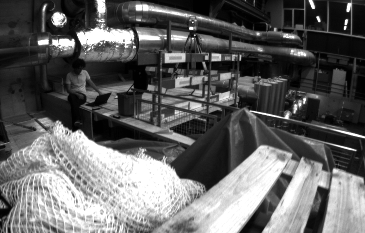 </td>
       <td>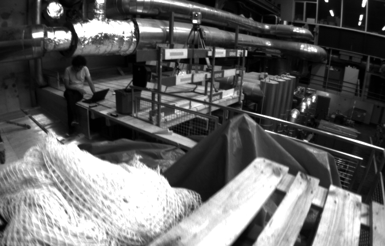 </td>
    </tr>
    <tr>
       <td> </td>
       <td>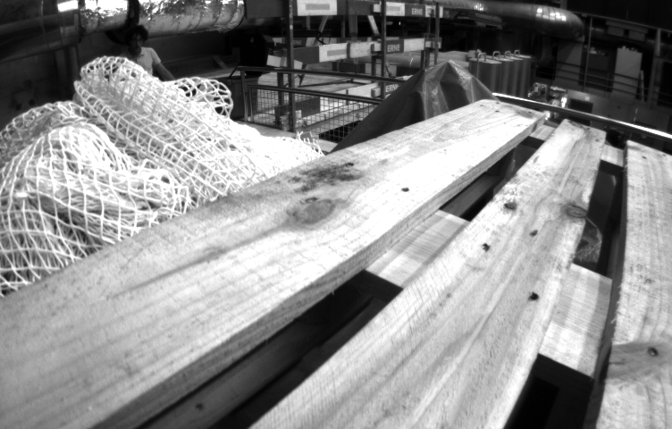 </td>
    </tr>
  </table>

## 1. Dependencies
   - OpenCV 3.2.0, OpenCV Contrib 3.2.0, C++ 11 version 

## 2. Methodology to apply feature matching
  - Use this Github Page [Feature Matching](https://github.com/SungJaeShin/Feature_matching)

## 3. Build and Run
Clone the repository and build and run simultaneously:
```  
   $ cd ${workspace}
   $ git clone https://github.com/SungJaeShin/Parallax.git
   $ cd Parallax/src
   $ sh compile_parallax_code.sh
```

## 4. Results (EuRoC dataset)
  - **[BEST CASE]** Best Results btw "**cand_1_3**" and "**cand_1_25**"
      ```
      ["cand_1_3" and "cand_1_25"]
      max dx: 12.2113, max dy: 108.67, max dist: 109.316
      avg dx: 11.7414, avg dy: 106.379, avg_dist: 107.026

      before filtering correspondence pair: 41
      optical flow corresponedence pair: 37
      after filtering correspondence pair: 13
      
      ["cand_1_25" and "cand_1_3"]
      max dx: 12.2113, max dy: 102.987, max dist: 103.708
      avg dx: 10.9453, avg dy: 100.462, avg_dist: 101.058
      
      before filtering correspondence pair: 32
      optical flow corresponedence pair: 17
      after filtering correspondence pair: 14
      ```
    - Results "cand_1_3" and "cand_1_25" using SIFT + DAISY
      
      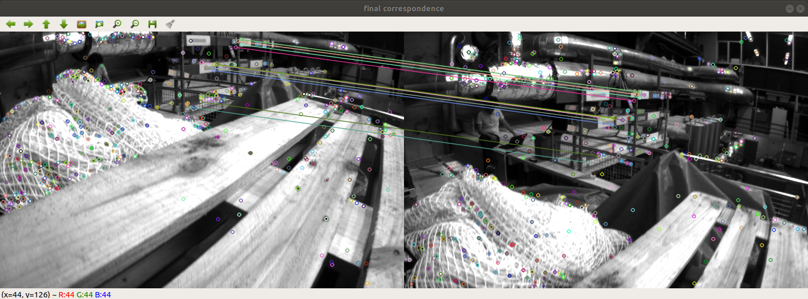
  
    - Results "cand_1_25" and "cand_1_3" using SIFT + DAISY
  
      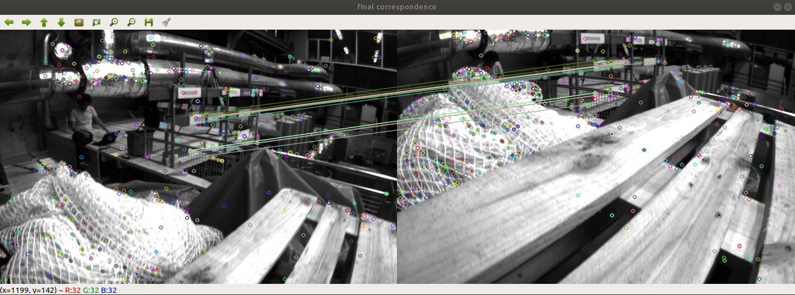
   

  - **[SIFT & SURF CASE]** Parallax Results btw "**cand_1_3**" and "**cand_1_35**" 
      ```
      [Before Filtering]
      max dx: 53.6179, max dy: 27.4187, max dist: 305.486
      avg dx: 16.4145, avg dy: 10.3494, avg dist: 27.3653
      
      [After Filtering]
      max dx: 24.8738, max dy: 20.0451, max dist: 24.9846
      avg dx: 15.0051, avg dy: 16.2881, avg_dist: 22.3998
      
      before filtering correspondence pair: 69
      optical flow corresponedence pair: 69
      after filtering correspondence pair: 63
      ```

    - Original Method using [Feature Matching](https://github.com/SungJaeShin/Feature_matching)
      
      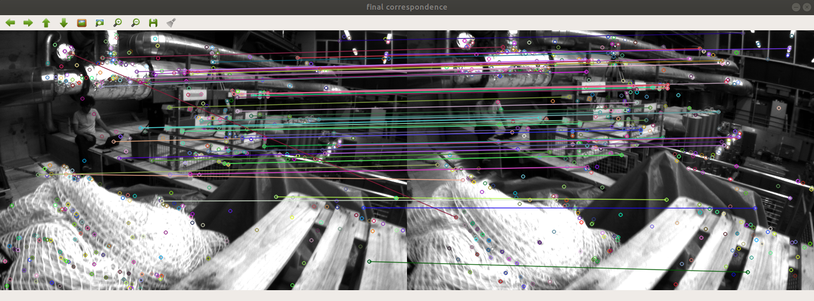

    - Filtered using optical flow method
      
      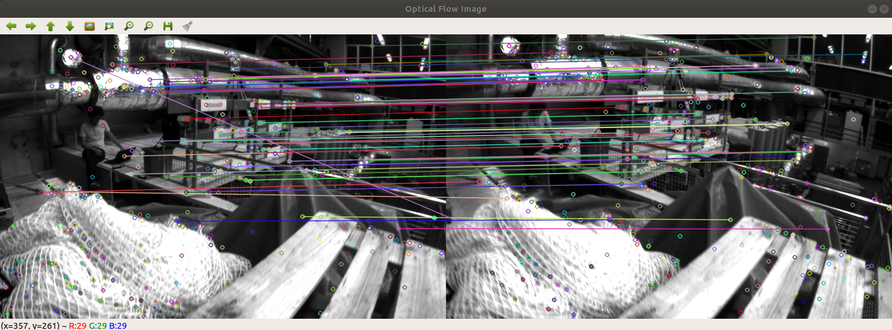
    
    - Filtered using parallax method
      
      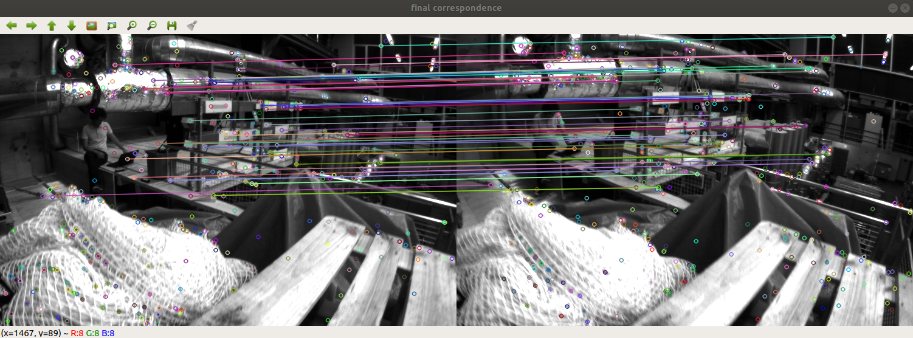
  
    - Failure case using parallax method
  
      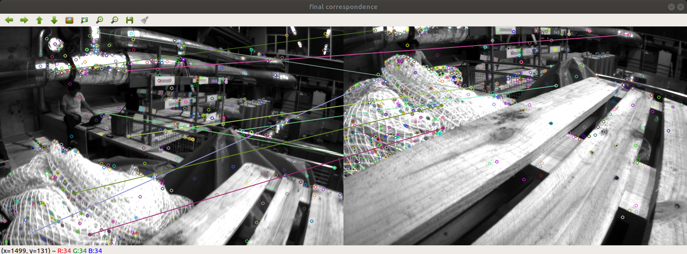

  - **[ORB & SURF CASE]** Parallax Results btw "**cand_1_3**" and "**cand_1_35**" 
      ```
      [Before Filtering]
      max dx: 54.5472, max dy: 336.038, max dist: 340.437
      avg dx: 15.6673, avg dy: 18.3601, avg dist: 24.8476
      
      [After Filtering]
      max dx: 18.72, max dy: 21, max dist: 25.2389
      avg dx: 14.2445, avg dy: 17.2931, avg_dist: 22.4969

      before filtering correspondence pair: 215
      optical flow corresponedence pair: 211
      after filtering correspondence pair: 203
      ```

    - Original Method using [Feature Matching](https://github.com/SungJaeShin/Feature_matching)
      
      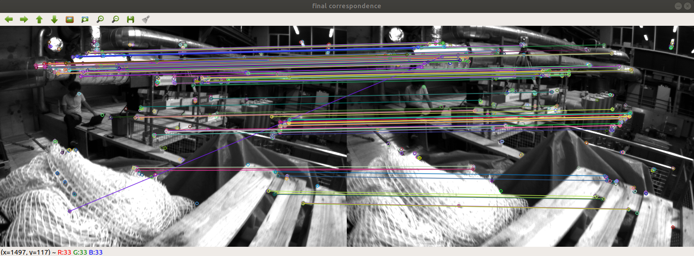

    - Filtered using optical flow method
      
      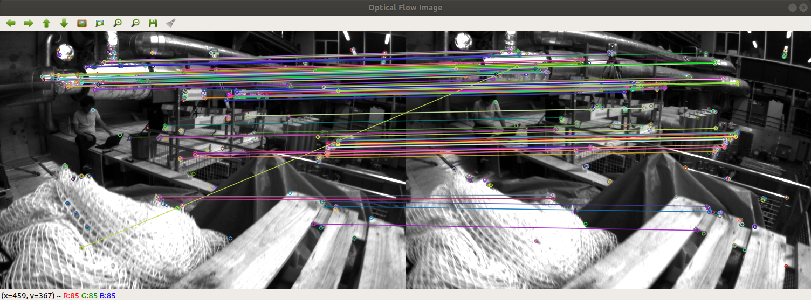
    
    - Filtered using parallax method
      
      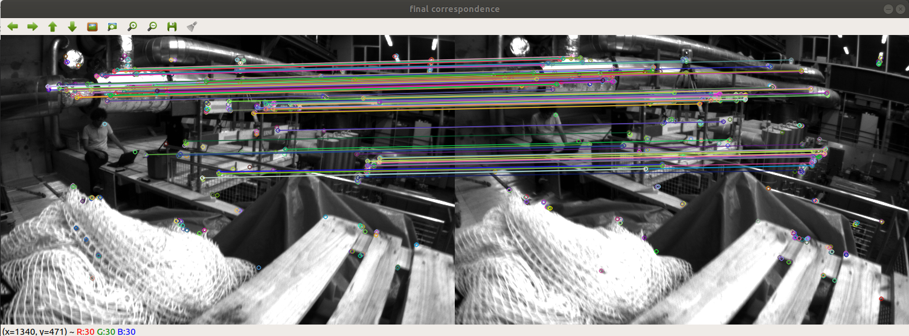
  
  - **[Solve Failure CASE]** Using DAISY btw "**cand_1_3**" and "**cand_1_35**"
      ```
      [GFTT + SURF CASE]
      max dx: 0, max dy: 0, max dist: 0
      avg dx: -nan, avg dy: -nan, avg_dist: -nan

      before filtering correspondence pair: 11
      optical flow corresponedence pair: 11
      after filtering correspondence pair: 11

      [GFTT + DAISY CASE]
      max dx: 20, max dy: 21, max dist: 25.807
      avg dx: 14.7667, avg dy: 16.1333, avg_dist: 21.9977

      before filtering correspondence pair: 36
      optical flow corresponedence pair: 36
      after filtering correspondence pair: 34
      ```
      - [GFTT + SURF CASE] Final Results

        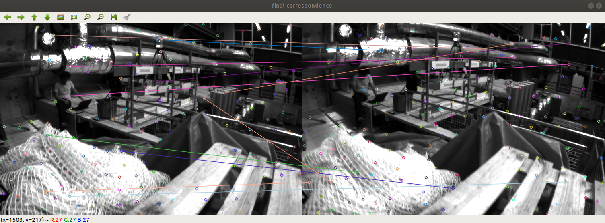
    
      - [GFTT + DAISY CASE] Final Results
      
        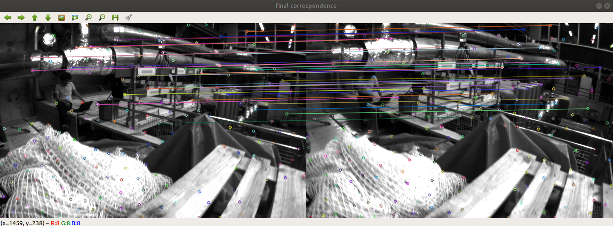

